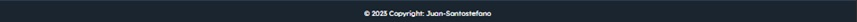
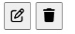

# Restaurant Advisor
This website gives you the opportunity to share your dining experiences at carefully chosen restaurants. You can leave detailed comments and opinions about the food, service and atmosphere of each restaurant, helping other users make informed decisions about where to eat. Discover new culinary gems and share your recommendations on this community restaurant review platform!


The LIVE website can be found [HERE](https://restaurant-advisor-28670efc3ab4.herokuapp.com/)

## Features

### Existing Features:

#### Home Page Desktop: 


#### Desktop Navigation Bar:


- Logo: Redirects to index.html
- Home: Redirects to index.html
- Login: Redirects to login.html
- Sign Up: Redirects to registration.html
- Profile: Redirects to profile_view.html

#### Social Media:


- Facebook logo: Open a new tab to www.facebook.com
- Twitter logo: Open a new tab to www.twitter.com
- Linkedin logo: Open a new tab to www.linkedin.com
- Youtube logo: Open a new tab to www.youtube.com

#### Copyright:



#### Alert messages:


##### Desktop Post detail :


##### Comment Section:


- You can see the user's comments

##### Add Comment Section:


- You can add a comment

#### Edit and Delete button:



- Edit button: Redirects to edit_comment.html where You can edit your comment
- Delete button: Redirects to delete_comment.html You can delete your comment

##### Login Page:


- You can Login with your username and password.

##### Sign Up Page:


- You can sign up with a username and password.

##### Profile Page:


- You can see all the profile information

##### Edit Profile Page:


- You can edit the profile information. (first name, last name, email, instagram and profile image)

##### Edit Comment Page:


- You can edit your comment

##### Delete Comment Page:


- You can delete your comment

#### Mobile Navigation Bar:


#### Header Mobile: 


#### Home Section Mobile: 


#### Footer Mobile:


##### Comment Section Mobile:


##### Mobile Post detail:


### Features Left to Implement:
- To give likes to the post and comments.
- To add the profile picture next to the username in comments section.
- To add new restaurants with the admin's approval.
- To add pictures on the comments
- To give the option to change the user's password

## UX

### Site Goals:
To build a platform that allows artists to easily share their work and passions with their fans, and art lovers who have yet to discover their talents. As well as to bring an engaging experience to artists and consumers alike. By having a display of artwork from a range of individuals, art-lovers will be able to easily peruse through pieces that engage them in a way that only art can.

### Design Choices:

#### Color Scheme


#### Typography:

Google Fonts: Lexend Deca
https://fonts.google.com/specimen/Lexend+Deca?query=lexend+deca

#### Imagery:
All the photos are from Google Images except the logo that was made with Chat GPT.

## User Stories
Not all stories have been implemented. Some have been left for future implementations as the site grows and expands.

### User stories:
#### As a user:
1. I can **Sign Up** so that **I can be able to write comments**.
 - Story points: 3
2. I can **edit my profile** so that **I can complete my personal information**.
 - Story points: 3
3. I can **write comments** so that **others client can view my review**.
 - Story points: 3
4. I can **edit and delete my own comments** so that **I can be able to fix any error in a comment**.
 - Story points: 4
5. I can **login and logout** so that **I can be able to write comments**.
 - Story points: 2

### Admin stories:
#### As an admin:
1. I can **submit new restaurant posts** so that **the customers can write more comments in more restaurants**.
 - Story points: 4
2. I can **delete post comments** so that **inappropiate comments can be deleted**.
 - Story points: 1
3. I can **create a log in / sign up page** so that **customers can sign up to the site**.
 - Story points: 2
4. I can **create a a profile per user** so that **customers can have their own profile information**.
 - Story points: 5

### Wireframes:

#### Desktop
<details>
    <summary>Home</summary>
    
</details>

<details>
    <summary>Login</summary>
    
</details>

<details>
    <summary>Sign Up</summary>
    
</details>

<details>
    <summary>Post detail</summary>
    
</details>

<details>
    <summary>Profile</summary>
    
</details>

<details>
    <summary>Edit Profile</summary>
    
</details>

<details>
    <summary>Edit Comment</summary>
    
</details>

<details>
    <summary>Delete Comment</summary>
    
</details>

#### Mobile
<details>
    <summary>Home</summary>
    
</details>

### Database Schema


### Audience:
Our core audience is made up of individuals who are passionate about food and gastronomic exploration.

### Communication:
With a post section, the users can write comments through the features of the website with an ease of navigation.

### Current User Goals:
Some users will enjoy interacting with other food lovers, whether through comments on reviews.

### New User Goals:
To become instantly engaged with the design of the site, and feel intrigued to explore all it has to offer.

### Future Goals:
- To get restaurant discounts for the users.
- That some users may aspire to become recognized food critics within the community, gaining followers and credibility in their opinions.

## Testing

### Automated Testing

#### W3C Validator


#### Jigsaw Validator


#### Lighthouse

- Desktop


- Mobile


#### WAVE


#### PEP8

<details>
    <summary>admin.py</summary>
    
</details>

<details>
    <summary>forms.py</summary>
    
</details>

<details>
    <summary>models.py</summary>
    
</details>

<details>
    <summary>settings.py</summary>
    
</details>

<details>
    <summary>views.py</summary>
    
</details>

### Manual Testing
#### NavBar
| Feature | Test case | Outcome |
|--|--|--|
| Logo | Click on the Logo | User is brought to the Home Page
| Navbar home link | Click on Home link | User is brought to the Home Page |
| Navbar home link - Hover | Hover the home link | The letters changes the color |
| Navbar Login link | Click on Login link | User is brought to the Login Page |
| Navbar Login link - Hover | Hover the Login link | The letters changes the color |
| Navbar Logout link | Click on Logout link | User is logged out and brought to the Home Page |
| Navbar Logout link - Hover | Hover the Logout link | The letters changes the color |
| Navbar Sign Up link | Click on Sign Up link | User is brought to the Sign Up Page |
| Navbar Sign Up link - Hover | Hover the Sign Up link | The letters changes the color |
| Navbar Profile link | Click on Profile link | User is brought to the Profile Page |
| Navbar Profile link - Hover | Hover the Profile link | The letters changes the color |

---

#### Footer
| Feature | Test case | Outcome |
|--|--|--|
| Footer Facebook link | Click on Facebook link | User is redirected to Facebook page on a new tab |
| Footer Facebook link - Hover | Hover the Facebook link | The circle color background changes the color |
| Footer Twitter link | Click on Twitter link | User is redirected to Twitter page on a new tab |
| Footer Twitter link - Hover | Hover the Twitter link | The circle color background changes the color |
| Footer LinkedIn link | Click on LinkedIn link | User is redirected to LinkedIn page on a new tab |
| Footer LinkedIn link - Hover | Hover the LinkedIn link | The circle color background changes the color |
| Footer Youtube link | Click on Youtube link | User is redirected to Youtube page on a new tab |
| Footer Youtube link - Hover | Hover the Youtube link | The circle color background changes the color |

---

#### Home Page
| Feature | Test case | Outcome |
|--|--|--|
| Reviews link | Click on Reviews | User is brought to the Post detail Page

---

#### Post Detail Page
| Feature | Test case | Outcome |
|--|--|--|
| Edit comment button | Click on Edit comment button | User is redirected to Edit comment page |
| Delete comment button | Click on Delete comment button | User is redirected to Delete comment page |
| Submit comment button | Click on Submit comment button | User post the comment wrote on textarea |

---

#### Edit Comment Page
| Feature | Test case | Outcome |
|--|--|--|
| Save Changes button | Click on Save Changes button | User succesfully changes the comment modified on the textarea |
| Go Back link | Click Go Back link | User is redirected to the Post detail page |

---

#### Delete Comment Page
| Feature | Test case | Outcome |
|--|--|--|
| Yes button | Click on Yes button | User succesfully delete their comment |
| No button | Click on No button | User is redirected to the Post detail page |

---

#### Login Page
| Feature | Test case | Outcome |
|--|--|--|
| Login button | Click on Login button | User login to the account if the username and password value is right |
| Sign Up link | Click on Sign Up link | User is brought to the Sign Up Page |

---

#### Sign Up Page
| Feature | Test case | Outcome |
|--|--|--|
| Login button | Click on Login button | User login to the account if the username and password value is right |
| Sign Up link | Click on Sign Up link | User is brought to the Sign Up Page |

---

#### Profile View Page
| Feature | Test case | Outcome |
|--|--|--|
| Edit Profile button | Click on Edit Profile button | User is redirected to Edit profile page |

---

#### Edit Profile Page
| Feature | Test case | Outcome |
|--|--|--|
| Save changes button | Click on Edit Profile button | User succesfully add or changes their profile information |

---

#### Account Registration Tests
| Test |Result  |
|--|--|
| User can create account | Pass |
| User can log into account| Pass|
|User can log out of account|Pass|
|SuperUser can access admin panel|Pass|

---

#### Account Security Tests

| Test |Result  |
|--|--|
|Non logged in user cannot make comments | Pass |
|Non logged in user cannot access profile page| Pass|
|Non superuser cannot access admin panel|Pass|

--- 

#### Admin Tests

| Test |Result  |
|--|--|
|Admin can add a post on index|Pass|
|Admin can add comments on post_detail|Pass|
|Admin can delete any comment|Pass|
|Admin can delete any user|Pass|
|Admin can delete any post|Pass|

### Unfixed Bugs


## Technologies Used
### Main Languages Used
- HTML5
- CSS3
- Javascript
- Python
- Django
- SQL - Postgres

### Frameworks, Libraries & Programs Used
- Google Fonts - for the font families: 
- Font Awesome - to add icons to the social links in the footer element.
- GitPod - to create my html files & styling sheet before pushing the project to Github.
- GitHub - to store my repository for submission.
- Favicon - to provide the code & image for the icon in the tab bar.
- Django
- Bootstrap

### Installed Packages:
- 'django<4' gunicorn
- dj_database_url psycopg2
- dj3-cloudinary-storage
- django-allauth 
- Pillow

## Deployment
The site was deployed to Heroku. The steps to deploy are as follows:
- Install Django & Gunicorn:
```pip3 install 'django<4' gunicorn```
- Install Django database & psycopg:
```pip3 install dj_database_url psycopg2```
- Install Cloudinary:
```pip3 install dj3-cloudinary-storage```
- Creating the requirements.txt file with the following command:
```pip3 freeze --local > requirements.txt```
- a django project was created using:
```django-admin startproject restaurantAdvisor .```
- the blog app was then created with:
```python3 manage.py startapp whereToEat```
- which was then added to the settings.py file within our project directory.
- the changes were then migrated using:
```python3 manage.py migrate```
- navigated to [Heroku](www.heroku.com) & created a new app called print-statements.
- added the Heroku Postgres database to the Resources tab.
- navigated to the Settings Tab, to add the following key/value pairs to the configvars:
1. key: SECRET_KEY | value: restaurantAdvisor
2. key: PORT | value: 8000
3. key: CLOUDINARY_URL | value: API environment variable
4. key: DATABASE_URL | value: value supplied by Heroku
- added the DATABASE_URL, SECRET_KEY & CLOUDINARY_URL to the env.py file
- added the DATABASE_URL, SECRET_KEY & CLOUDINARY_URL to the settings.py file
- add an import os statement for the env.py file.
- added Heroku to the ALLOWED_HOSTS in settings.py
- created the Procfile
- pushed the project to Github
- connected my github account to Heroku through the Deploy tab
- connected my github project repository, and then clicked on the "Deploy" button

## Credits
Codemy.com Youtube Chanel [HERE](https://www.youtube.com/@Codemycom)

### Media
- All the restaurant pictures were found in Google Images.
- Logo created with AI

