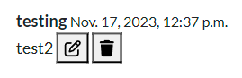

# Restaurant Advisor
This website gives you the opportunity to share your dining experiences at carefully chosen restaurants. You can leave detailed comments and opinions about the food, service and atmosphere of each restaurant, helping other users make informed decisions about where to eat. Discover new culinary gems and share your recommendations on this community restaurant review platform!

The LIVE website can be found [HERE](https://restaurant-advisor-28670efc3ab4.herokuapp.com/)

## Features

### Existing Features:

#### Home Page: 


##### Log in Page:


##### Sign Up Page:


##### Profile Page:


##### Edit Profile Page:


##### Post Page:


##### Edit Comment Page:


##### Delete Comment Page:


#### Navigation Bar:


#### Social Media:


#### Copyright:


#### Alert messages:


#### Edit and Delete button:



#### Blog Post Details:


### Features Left to Implement
- To give likes to the post and comments.
- To add the profile picture next to the username.
- To add new restaurants with the admin's approval.
- To add pictures on the comments
- Password reset


## UX

### Site Purpose:
The purpose of our website is to provide food lovers with an online space where they can discover, explore and share their dining experiences. Our platform is designed to help users find exceptional restaurants and make informed decisions about where to enjoy of their meals. By allowing users to leave detailed comments and opinions, we foster the culinary community and help improve the quality of restaurants by providing valuable feedback.

### Site Goal:
To build a platform that allows artists to easily share their work and passions with their fans, and art lovers who have yet to discover their talents. As well as to bring an engaging experience to artists and consumers alike. By having a display of artwork from a range of individuals, art-lovers will be able to easily peruse through pieces that engage them in a way that only art can.

### Audience:
Our core audience is made up of individuals who are passionate about food and gastronomic exploration.

### Communication:
With a post section, the users can write comments through the features of the website with an ease of navigation.

### Current User Goals:
Some users will enjoy interacting with other food lovers, whether through comments on reviews.

### New User Goals:
To become instantly engaged with the design of the site, and feel intrigued to explore all it has to offer.

### Future Goals:
- To get restaurant discounts for the users.
- That some users may aspire to become recognized food critics within the community, gaining followers and credibility in their opinions.

### Database Schema
#### Profile Model

| id | Field |
|--|--|
|User|OneToOneField  |
|first_name|Charfield|
|last_name|Charfield|
|instagram|Charfield|
|email|EmailField|
|profile_image|CloudinaryField|

#### Post Model

| id | Field |
|--|--|
|title|Charfield  |
|slug|SlugField|
|intro|TextField|
|body|TextField|
|image|CloudinaryField|

#### Comment Model

| id | Field |
|--|--|
|post|ForeignKey|
|name|ForeignKey|
|body|TextField|
|date_added|DateTimeField|

## User Stories
Not all stories have been implemented. Some have been left for future implementations as the site grows and expands.

### Admin stories:
#### As an admin:
1. I can **submit new restaurant posts** so that **the customers can write more comments in more restaurants**.
 - Story points: 4
2. I can **delete post comments** so that **inappropiate comments can be deleted**.
 - Story points: 1
3. I can **create a log in / sign up page** so that **customers can sign up to the site**.
 - Story points: 2
4. I can **create a a profile per user** so that **customers can have their own profile information**.
 - Story points: 5

### User stories:
#### As a user:
1. I can **Sign Up** so that **I can be able to write comments**.
 - Story points: 3
2. I can **edit my profile** so that **I can complete my personal information**.
 - Story points: 3
3. I can **write comments** so that **others client can view my review**.
 - Story points: 3
4. I can **edit and delete my own comments** so that **I can be able to fix any error in a comment**.
 - Story points: 4
5. I can **login and logout** so that **I can be able to write comments**.
 - Story points: 2


## Design
- Original template: https://startbootstrap.com/theme/freelancer


## Testing
#### Manual Testing

> Each user story was manually tested in line with intended functionality on both desktop & mobile.
> As this project was driven by my own User Stories I  felt manual testing was applicable on all logic code.

>If the intended outcome completes then this will be flagged as pass. If it does not then this is a fail.

#### Account Registration Tests
| Test |Result  |
|--|--|
| User can create account | Pass |
| User can log into account| Pass|
|User can log out of account|Pass|

---

#### User Navigation Tests

| Test |Result  |
|--|--|
|User can access to sign up | Pass |
|User can access to log in | Pass |
|User access account profile page|Pass|
|SuperUser can access admin panel|Pass|

---

#### Account Security Tests

| Test |Result  |
|--|--|
|Non logged in user cannot make comments | Pass |
|Non logged in user cannot access profile page| Pass|
|Non superuser cannot access admin panel|Pass|

---

#### Comment Tests

| Test |Result  |
|--|--|
|User can write a comment | Pass |
|User cannot submit a comment with empty form |Pass|
|User can edit their own comment |Pass|
|User can delete their own comment|Pass|

--- 

#### Profile Tests

| Test |Result  |
|--|--|
|User can edit / add a profile image from the profile page |Pass|
|User can edit / add Instagram account to their account| Pass|
|User can edit their first and last name |Pass|
|User can add / edit their email address|Pass|
|User cannot change their email to the same as another user |Failed|


#### Admin Tests

| Test |Result  |
|--|--|
|Admin can add a post on index|Pass|
|Admin can add comments on post_detail|Pass|
|Admin can delete any comment|Pass|
|Admin can delete any user|Pass|
|Admin can delete any post|Pass|


### Validator Testing
- html files pass through the [W3C validator](https://validator.w3.org/) with no html issues found
- Errors listed only reference  & {{}} tags.

- CSS files pass through the [Jigsaw validator](https://jigsaw.w3.org/css-validator/) 1149 errors found.


- Python files passed through [PEP8CI Online](https://pep8ci.herokuapp.com/) with only lines to long issues found.

- Tested the site opens in Brave without issues.
- All social links open to external pages as intended.

- Many style issues found and not to easy to edit because is a bootstrap [template](https://startbootstrap.com/previews/freelancer)

### Unfixed Bugs
- After signing up, the user is not loggin in automatically
- The alert messages are not dissapearing after 5 seconds.

## Technologies Used
### Main Languages Used
- HTML5
- CSS3
- Javascript
- Python
- Django
- SQL - Postgres

### Frameworks, Libraries & Programs Used
- Google Fonts - for the font families: 
- Font Awesome - to add icons to the social links in the footer element.
- GitPod - to create my html files & styling sheet before pushing the project to Github.
- GitHub - to store my repository for submission.
- Favicon - to provide the code & image for the icon in the tab bar.
- Django
- Bootstrap

### Installed Packages:
- 'django<4' gunicorn
- dj_database_url psycopg2
- dj3-cloudinary-storage
- django-allauth 
- Pillow

## Deployment
The site was deployed to Heroku. The steps to deploy are as follows:
- Install Django & Gunicorn:
```pip3 install 'django<4' gunicorn```
- Install Django database & psycopg:
```pip3 install dj_database_url psycopg2```
- Install Cloudinary:
```pip3 install dj3-cloudinary-storage```
- Creating the requirements.txt file with the following command:
```pip3 freeze --local > requirements.txt```
- a django project was created using:
```django-admin startproject restaurantAdvisor .```
- the blog app was then created with:
```python3 manage.py startapp whereToEat```
- which was then added to the settings.py file within our project directory.
- the changes were then migrated using:
```python3 manage.py migrate```
- navigated to [Heroku](www.heroku.com) & created a new app called print-statements.
- added the Heroku Postgres database to the Resources tab.
- navigated to the Settings Tab, to add the following key/value pairs to the configvars:
1. key: SECRET_KEY | value: restaurantAdvisor
2. key: PORT | value: 8000
3. key: CLOUDINARY_URL | value: API environment variable
4. key: DATABASE_URL | value: value supplied by Heroku
- added the DATABASE_URL, SECRET_KEY & CLOUDINARY_URL to the env.py file
- added the DATABASE_URL, SECRET_KEY & CLOUDINARY_URL to the settings.py file
- add an import os statement for the env.py file.
- added Heroku to the ALLOWED_HOSTS in settings.py
- created the Procfile
- pushed the project to Github
- connected my github account to Heroku through the Deploy tab
- connected my github project repository, and then clicked on the "Deploy" button

## Credits
Codemy.com Youtube Chanel [HERE](https://www.youtube.com/@Codemycom)

### Media
- All the restaurant pictures were found in Google Images.
- Logo created with AI

