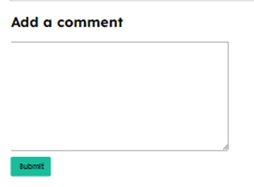
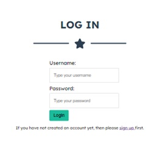

# Restaurant Advisor
This website gives you the opportunity to share your dining experiences at carefully chosen restaurants. You can leave detailed comments and opinions about the food, service and atmosphere of each restaurant, helping other users make informed decisions about where to eat. Discover new culinary gems and share your recommendations on this community restaurant review platform!


The LIVE website can be found [HERE](https://restaurant-advisor-28670efc3ab4.herokuapp.com/)

## Table of Contents
* [Features](#features)
    * [Existing Features](#existing-features)
    * [Features Left to Implement](#features-left-to-implement)
* [UX](#ux)
    * [Site Goals](#site-goals)
    * [Design Choices](#design-choices)
    * [User Experience](#user-experience)
        * [As a User](#as-a-user)
        * [As an admin](#as-an-admin)
    * [Wireframes](#wireframes)
    * [Database Schema](#database-schema)
* [Testing](#testing)
    * [Automated Testing](#automated-testing)
    * [Manual Testing](#manual-testing)
* [Technologies Used](#technologies-used)
    * [Main Languages Used](#main-languages-used)
    * [Frameworks, Libraries & Programs Used](#frameworks-libraries-&-programs-used)
* [Deployment](#forking-the-github-repository)
* [Credits](#credits)
    * [Media](#media)

[Back To Top](#restaurant-advisor)

## Features

### Existing Features:

#### Home Page Desktop: 


#### Desktop Navigation Bar:


- Logo: Redirects to index.html
- Home: Redirects to index.html
- Login: Redirects to login.html
- Sign Up: Redirects to registration.html
- Profile: Redirects to profile_view.html

#### Social Media:


- Facebook logo: Open a new tab to www.facebook.com
- Twitter logo: Open a new tab to www.twitter.com
- Linkedin logo: Open a new tab to www.linkedin.com
- Youtube logo: Open a new tab to www.youtube.com

#### Copyright:


#### Alert messages:


#### Desktop Post detail :


#### Comment Section:


- You can see the user's comments

#### Add Comment Section:



- You can add a comment

#### Edit and Delete button:


- Edit button: Redirects to edit_comment.html where You can edit your comment
- Delete button: Redirects to delete_comment.html You can delete your comment

#### Login Page:



- You can Login with your username and password.

#### Sign Up Page:


- You can sign up with a username and password.

#### Profile Page:


- You can see all the profile information

#### Edit Profile Page:


- You can edit the profile information. (first name, last name, email, instagram and profile image)

#### Edit Comment Page:


- You can edit your comment

#### Delete Comment Page:


- You can delete your comment

#### Mobile Navigation Bar:


#### Header Mobile: 


#### Home Section Mobile: 


#### Footer Mobile:


#### Comment Section Mobile:


#### Mobile Post detail:


### Features Left to Implement:
- To give likes to the post and comments.
- To add the profile picture next to the username in comments section.
- To add new restaurants with the admin's approval.
- To add pictures on the comments
- To give the option to change the user's password

## UX

### Site Goals:
To build a platform that allows artists to easily share their work and passions with their fans, and art lovers who have yet to discover their talents. As well as to bring an engaging experience to artists and consumers alike. By having a display of artwork from a range of individuals, art-lovers will be able to easily peruse through pieces that engage them in a way that only art can.

#### Audience:
Our core audience is made up of individuals who are passionate about food and gastronomic exploration.

#### Communication:
With a post section, the users can write comments through the features of the website with an ease of navigation.

#### Current User Goals:
Some users will enjoy interacting with other food lovers, whether through comments on reviews.

#### New User Goals:
To become instantly engaged with the design of the site, and feel intrigued to explore all it has to offer.

#### Future Goals:
- To get restaurant discounts for the users.
- That some users may aspire to become recognized food critics within the community, gaining followers and credibility in their opinions.

### Design Choices:

#### Color Scheme


#### Typography:

Google Fonts: Lexend Deca
https://fonts.google.com/specimen/Lexend+Deca?query=lexend+deca

#### Imagery:
All the photos are from Google Images except the logo that was made with Chat GPT.

## User Experience
Not all stories have been implemented. Some have been left for future implementations as the site grows and expands.

Kanban project board: https://github.com/users/jpsantostefano/projects/3

### As a user:
1. I can **Sign Up** so that **I can be able to write comments**.
 - Story points: 3
2. I can **edit my profile** so that **I can complete my personal information**.
 - Story points: 3
3. I can **write comments** so that **others client can view my review**.
 - Story points: 3
4. I can **edit and delete my own comments** so that **I can be able to fix any error in a comment**.
 - Story points: 4
5. I can **login and logout** so that **I can be able to write comments**.
 - Story points: 2

### As an admin:
1. I can **submit new restaurant posts** so that **the customers can write more comments in more restaurants**.
 - Story points: 4
2. I can **delete post comments** so that **inappropiate comments can be deleted**.
 - Story points: 1
3. I can **create a log in / sign up page** so that **customers can sign up to the site**.
 - Story points: 2
4. I can **create a a profile per user** so that **customers can have their own profile information**.
 - Story points: 5

### Wireframes:

#### Desktop
<details>
    <summary>Home</summary>
    
</details>

<details>
    <summary>Login</summary>
    
</details>

<details>
    <summary>Sign Up</summary>
    
</details>

<details>
    <summary>Post detail</summary>
    
</details>

<details>
    <summary>Profile</summary>
    
</details>

<details>
    <summary>Edit Profile</summary>
    
</details>

<details>
    <summary>Edit Comment</summary>
    
</details>

<details>
    <summary>Delete Comment</summary>
    
</details>

#### Mobile
<details>
    <summary>Home</summary>
    
</details>

### Database Schema


## Testing

### Automated Testing

#### W3C Validator


#### Jigsaw Validator


#### Lighthouse

- Desktop


- Mobile


#### WAVE


#### PEP8

<details>
    <summary>admin.py</summary>
    
</details>

<details>
    <summary>forms.py</summary>
    
</details>

<details>
    <summary>models.py</summary>
    
</details>

<details>
    <summary>settings.py</summary>
    
</details>

<details>
    <summary>views.py</summary>
    
</details>

### Manual Testing
#### NavBar
| Feature | Test case | Outcome |
|--|--|--|
| Logo | Click on the Logo | User is brought to the Home Page
| Navbar home link | Click on Home link | User is brought to the Home Page |
| Navbar home link - Hover | Hover the home link | The letters changes the color |
| Navbar Login link | Click on Login link | User is brought to the Login Page |
| Navbar Login link - Hover | Hover the Login link | The letters changes the color |
| Navbar Logout link | Click on Logout link | User is logged out and brought to the Home Page |
| Navbar Logout link - Hover | Hover the Logout link | The letters changes the color |
| Navbar Sign Up link | Click on Sign Up link | User is brought to the Sign Up Page |
| Navbar Sign Up link - Hover | Hover the Sign Up link | The letters changes the color |
| Navbar Profile link | Click on Profile link | User is brought to the Profile Page |
| Navbar Profile link - Hover | Hover the Profile link | The letters changes the color |

---

#### Footer
| Feature | Test case | Outcome |
|--|--|--|
| Footer Facebook link | Click on Facebook link | User is redirected to Facebook page on a new tab |
| Footer Facebook link - Hover | Hover the Facebook link | The circle color background changes the color |
| Footer Twitter link | Click on Twitter link | User is redirected to Twitter page on a new tab |
| Footer Twitter link - Hover | Hover the Twitter link | The circle color background changes the color |
| Footer LinkedIn link | Click on LinkedIn link | User is redirected to LinkedIn page on a new tab |
| Footer LinkedIn link - Hover | Hover the LinkedIn link | The circle color background changes the color |
| Footer Youtube link | Click on Youtube link | User is redirected to Youtube page on a new tab |
| Footer Youtube link - Hover | Hover the Youtube link | The circle color background changes the color |

---

#### Home Page
| Feature | Test case | Outcome |
|--|--|--|
| Reviews link | Click on Reviews | User is brought to the Post detail Page

---

#### Post Detail Page
| Feature | Test case | Outcome |
|--|--|--|
| Edit comment button | Click on Edit comment button | User is redirected to Edit comment page |
| Delete comment button | Click on Delete comment button | User is redirected to Delete comment page |
| Submit comment button | Click on Submit comment button | User post the comment wrote on textarea |

---

#### Edit Comment Page
| Feature | Test case | Outcome |
|--|--|--|
| Save Changes button | Click on Save Changes button | User succesfully changes the comment modified on the textarea |
| Go Back link | Click Go Back link | User is redirected to the Post detail page |

---

#### Delete Comment Page
| Feature | Test case | Outcome |
|--|--|--|
| Yes button | Click on Yes button | User succesfully delete their comment |
| No button | Click on No button | User is redirected to the Post detail page |

---

#### Login Page
| Feature | Test case | Outcome |
|--|--|--|
| Login button | Click on Login button | User login to the account if the username and password value is right |
| Sign Up link | Click on Sign Up link | User is brought to the Sign Up Page |

---

#### Sign Up Page
| Feature | Test case | Outcome |
|--|--|--|
| Login button | Click on Login button | User login to the account if the username and password value is right |
| Sign Up link | Click on Sign Up link | User is brought to the Sign Up Page |

---

#### Profile View Page
| Feature | Test case | Outcome |
|--|--|--|
| Edit Profile button | Click on Edit Profile button | User is redirected to Edit profile page |

---

#### Edit Profile Page
| Feature | Test case | Outcome |
|--|--|--|
| Save changes button | Click on Edit Profile button | User succesfully add or changes their profile information |

---

#### Account Registration Tests
| Test |Result  |
|--|--|
| User can create account | Pass |
| User can log into account| Pass|
|User can log out of account|Pass|
|SuperUser can access admin panel|Pass|

---

#### Account Security Tests

| Test |Result  |
|--|--|
|Non logged in user cannot make comments | Pass |
|Non logged in user cannot access profile page| Pass|
|Non superuser cannot access admin panel|Pass|

--- 

#### Admin Tests

| Test |Result  |
|--|--|
|Admin can add a post on index|Pass|
|Admin can add comments on post_detail|Pass|
|Admin can delete any comment|Pass|
|Admin can delete any user|Pass|
|Admin can delete any post|Pass|

### Unfixed Bugs


## Technologies Used
### Main Languages Used
- HTML5
- CSS3
- Python
- Django
- SQL - Postgres

### Frameworks, Libraries & Programs Used
- [Google Fonts](https://fonts.google.com/) - to import the fonts used on the website.
- [Font Awesome](https://fontawesome.com/start) - to add icons to the social links in the footer element.
- [GitPod](https://gitpod.io/) - to create my html files & styling sheet before pushing the project to Github.
- [GitHub](https://github.com/) - to store my repository for submission.
- [Favicon](https://favicon.io/) - to provide the code & image for the icon in the tab bar.
- [Django](https://www.djangoproject.com/) - to develop the website
- [Coolors](https://coolors.co/) - to select the colour pallette for the site.
- [CloudConvert](https://cloudconvert.com/jpg-to-webp) - to convert images to .webp format.
- [Balsamiq](https://balsamiq.com/) - to create wireframes

## Deployment

This project was deployed to [Heroku](https://www.heroku.com)

After installing Django and the supporting libraries, the basic Django project was created and migrated to the database. 

I am using a postgreSQL database instance hosted on [ElephantSQL](https://www.elephantsql.com/) as this service is free. 

<details>
<summary>Steps taken before deploying the project to Heroku</summary>

### Create the Heroku App

1. Login to Heroku and click on the top right button ‘New’ on the dashboard. 
2. Click ‘Create new app’.
3. Give your app a unique name and select the region closest to you. 
4. Click on the ‘Create app’ button.

### Create the PostgreSQL Database

1. Login to ElephantSQL and click on the top right button ‘Create New Instance’.
2. Give your plan the name of the project and select the Tiny Turtle (Free) plan.  The ‘Tags’ field can be left empty.  
3. Click on ‘Select Region’ and select a data centre near you and click ‘Review’.  
4. Make sure your plan is correct and click ‘Create Instance’. 
5. Return to the dashboard and click on this project’s instance you just created. This will open up the “Details” page where the link to the URL is displayed.  This needs to be added to the env.py file in the project’s directories.

### Create the env.py file

With the database created, it now needs to be connected with the project.

1. In order to keep these variables hidden, it is important to create an env.py file and add it to .gitignore.  
2. At the top **import os** and set the DATABASE_URL variable using the `os.environ` method. Add the URL copied from instance created above to it, like so:
`os.environ[“DATABASE_URL”] = ”copiedURL”`
3. The Django application requires a SECRET_KEY to encrypt session cookies.
Example: `os.environ[“SECRET_KEY”] = ”secretKey”`

### Modify settings.py 

It is important to make the Django project aware of the env.py file and to connect the workspace to the new database. 

1. Open up the settings.py file and add the following code. The if statement acts as a safety net for the application in case it is run without the env.py file.
```
import os
import dj_database_url

if os.path.isfile(‘env.py’):
    import env
```
2. Remove the insecure secret key provided by Django and reference the variable set in the env.py file earlier, like so:
```
SECRET_KEY = os.environ.get(‘SECRET_KEY’)
```
3. You can leave DEBUG as True or set it to `'DEVELOPMENT' in os.environ` and then add the following to the env.py file:
```
os.environ["DEVELOPMENT"] = "True"
```
4. Hook up the database using the dj_database_url import added above.  The original DATABASES variable provided by Django connects the Django application to the created db.sqlite3 database within your repo.  This database is not suitable for production so add the following conditional to tell Django to use the external database if there is one or to use the local sqlite version if not. 
```
if 'DATABASE_URL' in os.environ:
    DATABASES = {
        'default': dj_database_url.parse(os.environ.get('DATABASE_URL'))
    }
else:
    DATABASES = {
        'default': {
            'ENGINE': 'django.db.backends.sqlite3',
            'NAME': os.path.join(BASE_DIR, 'db.sqlite3'),
        }
    }
```

**NOTE**: If at the start of the development you are using the local db.sqlite3, make sure to add it to the .gitignore file, so as not to make the mistake of pushing it to your repository.  

5. Save and migrate this database structure to the newly connected postgreSQL database.  Run the migrate command in your terminal
`python3 manage.py migrate`
6. To make sure the application is now connected to the remote database hosted on ElephantSQL, head over to your ElephantSQL dashboard and select the newly created database instance. Select the ‘Browser’ tab on the left and click on ‘Table queries’.  This displays a dropdown field with the database structure which has been populated from the Django migrations. 

### Connect the Database to Heroku

1. Open up the Heroku dashboard, select the project’s app and click on the ‘Settings’ tab.
2. Click on ‘Reveal Config Vars’ and add the DATABASE_URL with the value of the copied URL from the database instance created on ElephantSQL.
3. Also add the SECRET_KEY with the value of the secret key added to the env.py file. 
4. If using gitpod another key needs to be added in order for the deployment to succeed.  This is PORT with the value of 8000.

### Cloudinary Setup

1. Go to your [Cloudinary](https://cloudinary.com) account's dashboard and click on the ‘API environment variable’ to copy to clipboard.  This is used to connect your app to your Cloudinary account.  Add this to the env.py file in your workspace using CLOUDINARY_URL as the variable name.  Remember to remove the first part of the URL (CLOUDINARY_URL=) as this will give you a failed deployment.  
2. Copy and paste this value into the Heroku config vars with the key CLOUDINARY_URL.
3. In Heroku add one more temporary variable to help get the project deployed without static files.  This needs to be removed before deploying the full project.  Use DISABLE_COLLECTSTATIC as the key and ‘1’ as the value.
4. Go to settings.py and add the Cloudinary libraries in the list of INSTALLED_APPS.  Place ‘cloudinary_storage’ above the ‘django.contrib.staticfiles’ and ‘cloudinary’ just above the main app.
5. Scroll down the the STATIC_URL variable and add the following to instruct Django to use Cloudinary to store media and static files.
```
STATICFILES_STORAGE = ‘cloudinary_storage.storage.StaticHashedCloudinaryStorage’
STATICFILES_DIRS = [os.path.join(BASE_DIR, ‘static’)]
STATIC_ROOT = os.path.join(BASE_DIR, ‘staticfiles’)

MEDIA_URL = ‘/media/’
DEFAULT_FILE_STORAGE = ‘cloudinary_storage.storage.MediaHashedCloudinaryStorage’
```

### Setup the Templates Directory

In settings.py, add the following under BASE_DIR 
`TEMPLATES_DIR = os.path.join(BASE_DIR, "templates")`
then scroll down to the TEMPLATES variable and add the following to the value of DIRS:
```
'DIRS': [TEMPLATES_DIR],
```

### Add the Heroku Host Name

In settings.py scroll to ALLOWED_HOSTS and add the Heroku host name.  This should be the Heroku app name created earlier followed by `.herokuapp.com`.  Add in `’localhost’` so that it can be run locally.
```
ALLOWED_HOSTS = [‘heroku-app-name.herokuapp.com’, ‘localhost’]
```

### Create the Directories and the Process File

1. Create the media, static and templates directories at the top level next to the manage.py file. 
2. At the same level create a new file called ‘Procfile’ with a capital ‘P’.  This tells Heroku how to run this project.  
3. Add the following code, including the name of your project directory. 
```
web: gunicorn restaurantAdvisor.wsgi:application
```
* ‘web’ tells Heroku that this a process that should accept HTTP traffic.
* ‘gunicorn’ is the server used.
* ‘wsgi’, stands for web services gateway interface and is a standard that allows Python services to integrate with web servers.
4. Save everything and push to GitHub. 

</details>

<details>
<summary>First Deployment</summary>

### First Deployment

1. Go back to the Heroku dashboard and click on the ‘Deploy’ tab.  
2. For deployment method, select ‘GitHub’ and search for the project’s repository from the list. 
3. Select and then click on ‘Deploy Branch’.  
4. When the build log is complete it should say that the app has been successfully deployed.
5. Click on the ‘Open App’ button to view it and the Django “The install worked successfully!” page, should be displayed. 

</details>

<details>
<summary>Final Deployment</summary>

### Final Deployment

1. When development is complete, if you had left `DEBUG = True` in the settings.py file, make sure to change it to `False`. You don't have to change anything if you had used `DEBUG = 'DEVELOPMENT' in os.environ` as your env.py file is ignored by GitHub. 
2. Commit and push your code to your project's repository.
3. Then open up Heroku, navigate to your project's app. Click on the 'settings' tab, open up the config vars and delete the DISABLE_COLLECTSTATIC variable. 
4. Navigate to the 'Deploy' tab and scroll down to 'Deploy a GitHub branch'.
5. Select the branch you want to deploy and click on the 'Deploy branch' button. When the app is deployed, you should see a message in the built log saying "Your app was successfully deployed".  Click 'View' to see the deployed app in the browser. Alternatively, you can click on the 'Open App' button at the top of the page. 

</details>

## Credits
Codemy.com Youtube Chanel [HERE](https://www.youtube.com/@Codemycom)

### Media
- All the restaurant pictures were found in Google Images.
- Logo created with AI

